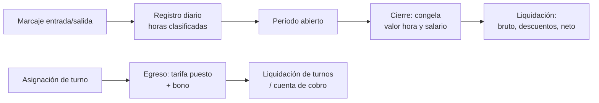
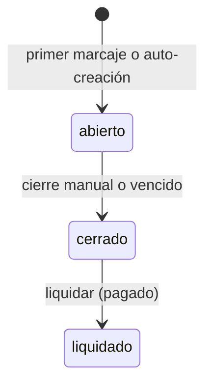
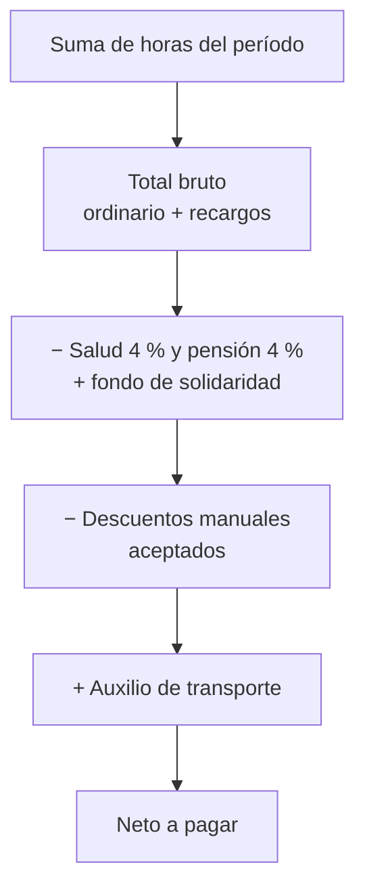
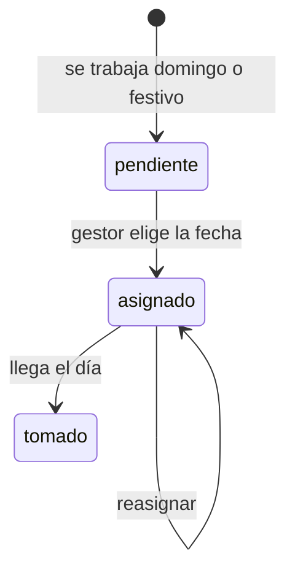

# Zaturno — Reglas de cálculo de pagos

Actualizado: 23 de septiembre de 2026

> Fuente de verdad del código: `backend/config/constants.js` y `backend/utils/laboralUtils.js`. Si cambias una regla, actualiza este documento y regenera `backend/documentos/reglas-calculo-pagos.pdf` con `node backend/scripts/generar-pdf-reglas.js` (las secciones 1 a 9 se publican; 10 y 11 son internas). El PDF es para quien administra la empresa, no para todo el equipo: se descarga autenticado desde `GET /api/empresas/reglas-pago` (solo `admin_empresa`), enlazado en Configuración → Mi plan (web) y Mi empresa (móvil).

## 1. Resumen: quién cobra y cómo

Zaturno paga por dos circuitos que no se mezclan: **nómina**, que liquida horas con recargos de ley por período, y **turnos**, que paga una tarifa fija por día del puesto. El circuito lo decide `trabajadores.tipo`.

| Tipo de trabajador | Circuito | Qué se paga | Cadencia |
| --- | --- | --- | --- |
| `nomina` | Nómina | Salario base (o tarifa hora) + recargos nocturno, extra y festivo | La de la empresa: mensual, quincenal o semanal |
| `turnos` | Turnos | Tarifa del puesto por turno completado + bono | Ciclo de la empresa (período de turnos eventuales, segmento `turnos`) |
| `ambos` | Turnos | Igual que `turnos` | Igual que `turnos` |
| `nomina` que toma un turno eventual | Turnos eventuales, segmento `nomina` | Tarifa del puesto + bono | Trimestral |

Dos datos de la empresa cambian el cálculo:

- **`tipo_contrato`**: `laboral` descuenta salud y pensión y paga auxilio de transporte; `prestacion_servicios` no descuenta nada (el independiente se autoliquida) y genera cuentas de cobro.
- **`tipo_liquidacion`**: `mensual`, `quincenal` o `semanal`; define los días de cada período de nómina.

Dos datos del trabajador cambian el cálculo en nómina:

- **`salario_base`** (mensual): cobra el sueldo completo prorrateado por días, más recargos. Si tiene los dos campos cargados, el salario manda.
- **`tarifa_hora`**: cobra solo las horas trabajadas, cada una con su multiplicador.



Arriba, el circuito de nómina; abajo, el de turnos. Las secciones 2 a 6 cubren nómina y la 7 cubre turnos.

## 2. Cómo se recogen las horas (nómina)

Cada día trabajado es un **registro diario** con hora de entrada y salida; al marcar la salida el sistema clasifica las horas y las guarda en ese registro. La liquidación solo suma lo que ya está guardado.

### Marcaje por el trabajador

1. **Entrada** (solo rol `trabajador_nomina`): la hora la pone el servidor (hora de Colombia), no el celular. Si no hay período abierto para hoy, se crea automáticamente según `tipo_liquidacion`. Un solo registro por trabajador y día.
2. **Salida**: exige entrada previa y período abierto. Puede cruzar medianoche (turno nocturno). Aquí se calculan las horas (sección 3).
3. **Jornada continua**: al cerrar, el trabajador indica si NO tomó almuerzo. Si la jornada supera 6 h y sí lo tomó, se descuentan 60 min.

### Validación de ubicación (`tipo_marcacion`)

| Tipo | Regla al marcar entrada y salida |
| --- | --- |
| `libre` | Marca desde cualquier lugar. La app móvil exige enviar GPS; el backend no lo exige. |
| `fijo` | Debe estar dentro del radio (`radio_metros`) de su punto de marcaje asignado; sin punto asignado no puede marcar. |
| `zonal` | Debe estar dentro del radio de alguno de los puntos zonales activos; si la empresa no tiene puntos zonales, no bloquea. |

### Marcaje sospechoso

Si dos trabajadores marcan desde el **mismo dispositivo** y a **menos de 50 m** en una ventana de **5 minutos**, ambos registros quedan marcados como sospechosos y se avisa a los gestores. No bloquea el pago; el gestor lo revisa y descarta.

### Reingreso el mismo día

Después de marcar salida, el trabajador puede pedir reingreso con un motivo. Si el gestor lo aprueba, marca una nueva entrada y el registro pasa a tener varias sesiones. Las horas de cada sesión se suman al día y cuentan para el tope semanal (si la primera sesión agotó las 42 h, la segunda va a extra).

### Registros manuales y correcciones

- **Crear** un registro manual: `admin_empresa`, `jefe_nomina`, `nomina` o el propio trabajador. Solo en período abierto, dentro de sus fechas, nunca un día futuro, y la salida debe ser posterior a la entrada.
- **Corregir** horas: solo `admin_empresa` y `jefe_nomina`, en período abierto. Un registro con varias sesiones no se puede corregir a mano.
- Toda creación o corrección recalcula las horas con las mismas reglas del marcaje.
- **Tipo de día**: `ordinario`, `descanso`, `compensatorio`, `incapacidad`, `vacacion`, `licencia` o `ausencia`.

### Avisos automáticos

- **Horas extra**: si un trabajador con jornada abierta empieza a acumular horas extra, se le avisa a él y a los gestores una sola vez.
- **Recordatorio de ingreso**: si tiene horario fijo y no ha marcado a su hora esperada, se le recuerda una vez al día.

## 3. Clasificación de cada minuto

`calcularHoras()` recorre la jornada **minuto a minuto** y pone cada minuto en uno de cinco baldes; al final los convierte a horas con dos decimales. Los minutos de almuerzo se saltan.

| Balde | Cuándo cae un minuto aquí | Campo del registro |
| --- | --- | --- |
| Festivo | El día es domingo o festivo y lleva recargo (ver domingo ocasional) | `horas_festivo` |
| Ordinaria diurna | Queda cupo de las 42 h semanales y es de día | `horas_ordinarias` |
| Ordinaria nocturna | Queda cupo de las 42 h semanales y es de noche | `horas_nocturnas` |
| Extra diurna | Ya se agotó el cupo semanal y es de día | `horas_extra_diurnas` |
| Extra nocturna | Ya se agotó el cupo semanal y es de noche | `horas_extra_nocturnas` |

El orden importa: si el día es festivo con recargo, **todos** sus minutos van a festivo, aunque sean de noche o superen el tope.

### Día o noche

| Fecha trabajada | Horario nocturno |
| --- | --- |
| Desde el 25-dic-2025 (Ley 2466, art. 10) | 19:00 a 06:00 |
| Antes | 21:00 a 06:00 |

La regla sale de la **fecha del registro**: un registro viejo se sigue clasificando con la regla de su época.

### Extra: el tope es semanal, no diario

- La semana va de **lunes a domingo** y el cupo ordinario es **42 h** (Ley 2101, desde el 15-jul-2026).
- Antes de clasificar, se suman las horas ordinarias y nocturnas ya registradas esa semana (lunes hasta ayer), más las horas del festivo acreditadas por un compensatorio tomado esa semana.
- Lo que falte para 42 h es ordinario; el resto del turno es extra. Un día de 12 h puede ser todo ordinario si la semana va corta.
- Las horas festivas no consumen el cupo de la semana.

### Almuerzo

Si la jornada supera **6 h** y el trabajador no marcó jornada continua, se descuentan **60 minutos**, tomados del final del bloque diurno para no quitar horas nocturnas. Si todo el turno es nocturno, no hay de dónde descontar y no se descuenta.

### Domingos y festivos

- **Festivos** reconocidos: domingos; fijos (1 ene, 1 may, 20 jul, 7 ago, 8 dic, 25 dic); los de Ley Emiliani trasladados al lunes (6 ene, 19 mar, 29 jun, 15 ago, 12 oct, 1 nov, 11 nov); y los de Semana Santa (jueves y viernes santo; Ascensión, Corpus Christi y Sagrado Corazón trasladados al lunes). Se calculan para cualquier año.
- **Festivo entre semana**: siempre lleva recargo.
- **Domingo ocasional** (Art. 180 CST): el 1.º y 2.º domingo trabajado del mes calendario **no** llevan recargo en dinero; sus horas se clasifican como un día normal (ordinarias, nocturnas o extra) y generan descanso compensatorio.
- **Domingo habitual**: del 3.º domingo trabajado del mes en adelante, todas sus horas van a festivo con recargo.

## 4. Valor de la hora, salario y períodos

El valor de la hora ordinaria es **salario mensual ÷ 210** (jornada de 42 h: 42 ÷ 6 días × 30); si el trabajador no tiene salario mensual, es su `tarifa_hora`. Con el mínimo 2026 ($1.750.905), la hora vale $8.338.

```latex
\text{valor hora} = \frac{\text{salario base}}{210}
```

### Pago ordinario del período

| Tipo de trabajador | Pago ordinario |
| --- | --- |
| Salario mensual | Salario ÷ 30 × días comerciales del período, completo aunque haya trabajado menos horas. Las inasistencias se descuentan aparte (sección 6). |
| Tarifa hora | Horas ordinarias diurnas × tarifa. Las nocturnas, extras y festivas se pagan en sus propios conceptos. |

Los días se cuentan en **mes comercial de 30 días**, la convención de nómina en Colombia: toda quincena vale 15 días y todo mes 30, traiga el mes 28, 29 o 31 días; un período semanal vale 7. El auxilio de transporte se prorratea igual.

### Períodos de nómina

| Tipo (`tipo_liquidacion`) | Fechas |
| --- | --- |
| Mensual | Del 1 al último día del mes |
| Quincenal | Del 1 al 15, y del 16 al último día del mes |
| Semanal | Lunes a domingo |



- **Abierto**: se marcan, crean y corrigen registros.
- **Cerrado**: se congela el pago (ver abajo) y ya no se tocan registros. Un período vencido se cierra solo la próxima vez que se crea uno nuevo; si la empresa es de prestación de servicios, al cerrarse se generan las cuentas de cobro.
- **Liquidado**: marca que ya se pagó y avisa a los usuarios de nómina: «¡Tu nómina fue pagada!».

### Congelamiento al cerrar

Al cerrar, en una sola transacción, cada registro del período guarda:

- `valor_hora_snapshot`: salario ÷ 210 si tiene salario mensual; si no, su tarifa hora.
- `salario_base_snapshot`: el salario mensual vigente.

La liquidación de un período cerrado usa esos valores congelados, así un aumento de sueldo posterior no cambia lo ya pagado. Un período abierto usa el sueldo actual.

## 5. Recargos y fórmulas por concepto

Cada balde de horas se paga como **horas × valor hora × multiplicador**; el multiplicador depende del concepto, del tipo de trabajador y, en festivos, de la fecha.

```latex
\text{pago concepto} = \text{horas} \times \text{valor hora} \times \text{multiplicador}
```

| Concepto | Asalariado | Por tarifa hora | Por qué difieren |
| --- | --- | --- | --- |
| Ordinaria diurna | Incluida en el salario | × 1,00 | El salario ya la paga |
| Ordinaria nocturna | × 0,35 | × 1,35 | Al asalariado solo le falta el recargo del 35 %; al de tarifa, la hora + el recargo |
| Extra diurna | × 1,25 | × 1,25 | Fuera de la jornada: el salario no la cubre |
| Extra nocturna | × 1,75 | × 1,75 | Ídem |
| Dominical / festivo | Según fecha (tabla abajo) | Según fecha | Se paga completo encima del salario |

### Recargo dominical y festivo (Ley 2466, art. 14)

| Vigente desde | Multiplicador |
| --- | --- |
| 1-jul-2027 | × 2,00 |
| 1-jul-2026 (vigente hoy) | × 1,90 |
| 1-jul-2025 | × 1,80 |
| Antes | × 1,75 |

El multiplicador festivo se toma de la **fecha de fin del período** que se liquida. El que se aplicó viaja en la liquidación como `recargo_festivo`, igual que el nocturno en `recargo_nocturno`; las pantallas de web y móvil muestran esos valores en vez de un número fijo.

### Valores hora con el mínimo 2026

| Concepto | Asalariado | Por tarifa (hora $8.338) |
| --- | --- | --- |
| Ordinaria nocturna | $2.918 | $11.256 |
| Extra diurna | $10.422 | $10.422 |
| Extra nocturna | $14.591 | $14.591 |
| Festivo (sep-2026) | $15.842 | $15.842 |

```latex
\text{total bruto} = \text{pago ordinario} + \text{nocturno} + \text{extra diurno} + \text{extra nocturno} + \text{festivo}
```

## 6. Liquidación del período, paso a paso

La liquidación se calcula **al momento de consultarla**, con una línea por trabajador: suma sus registros del período, aplica recargos, descuentos de ley, descuentos manuales aceptados y auxilio de transporte.



1. **Total bruto** = pago ordinario (sección 4) + nocturno + extra diurno + extra nocturno + festivo (sección 5). Cada concepto se redondea a centavos (2 decimales).
2. **Descuentos de ley** (solo empresas con `tipo_contrato = laboral`), calculados sobre el total bruto:
    - Salud: 4 %.
    - Pensión: 4 % + Fondo de Solidaridad Pensional si el bruto es de 4 SMMLV o más.
    - ARL y caja de compensación no se descuentan: los paga el empleador.
3. **Descuentos manuales**: solo los que el trabajador **aceptó** (ver abajo).
4. **Auxilio de transporte** (solo `laboral`): $249.095 al mes, proporcional a los días comerciales del período (÷ 30 × días), si el salario mensual equivalente (valor hora × 210) no supera 2 SMMLV ($3.501.810). No es base de descuentos.
5. **Neto** = bruto − descuentos de ley − descuentos manuales + auxilio.

### Fondo de Solidaridad Pensional

| Bruto del período (en SMMLV) | Aporte adicional a pensión |
| --- | --- |
| Menos de 4 | 0 % |
| 4 a menos de 16 | 1,0 % |
| 16 | 1,2 % |
| 17 | 1,4 % |
| 18 | 1,6 % |
| 19 | 1,8 % |
| 20 o más | 2,0 % |

### Descuentos manuales

- Tipos: `prestamo`, `inasistencia`, `dano_equipo`, `anticipo`, `otro`. Monto mayor a 0.
- El gestor lo registra en un período no liquidado; queda **pendiente** y se notifica al trabajador.
- El trabajador lo **acepta** o **rechaza** desde la app (solo él, una vez). Solo los aceptados restan del neto.
- Se puede eliminar mientras el período no esté liquidado.

### Quién ve qué

| Rol | Ve la liquidación |
| --- | --- |
| `admin_empresa`, `jefe_nomina`, `nomina` | Todas las líneas del período, con totales, y Excel con marcajes |
| `trabajador_nomina` | Solo su propia línea |

En la app, el trabajador también ve un **estimado diario** calculado en el celular a partir de sus registros. Es orientativo: el valor oficial es el de la liquidación.

## 7. Turnos: tarifa por día, bonos, contratos y cuentas de cobro

Un turno completado paga **la tarifa del día del puesto + el bono**, sin importar cuántas horas duró; los turnos no aplican recargos nocturnos, extras ni festivos.

```latex
\text{pago del turno} = \text{tarifa del puesto} + \text{bono}
```

### Cómo se recoge

1. El gestor publica una **oferta** con uno o varios **puestos**; cada puesto tiene su cargo y su `tarifa_dia`.
2. El trabajador se postula a un puesto y queda asignado.
3. **Ingreso**: marca con validación de ubicación del turno.
4. **Egreso**: marca, firma y el turno pasa a `completado`. Se guardan las horas trabajadas (desde el ingreso hasta la salida, recortadas a la hora de fin estimada) y se fija el pago = tarifa del puesto + bono.
5. **Cierre masivo** de la jornada por el gestor: los que están en curso pasan a completados (mismas reglas) y los confirmados que nunca llegaron quedan `no_presentado`, sin pago.

### Bonos

- Los asignan `admin_empresa` o `jefe_turnos`, por turno; monto de 0 o más, con motivo obligatorio si es mayor a 0.
- Se suman al pago de inmediato si el turno ya está completado.
- Si el contrato del turno ya estaba firmado, cambiar el bono **anula la firma** y el trabajador debe volver a firmar.

### Contratos diarios

- Cada turno genera un contrato diario, laboral o de prestación de servicios según la empresa.
- La tarifa del día debe ser al menos el **salario mínimo diario**: SMMLV ÷ 30, redondeado hacia arriba ($58.364 en 2026).
- Tope de acumulación: con 40 contratos en 12 meses el sistema alerta; con **50** bloquea nuevos contratos para ese trabajador.

### Cuándo y cómo se paga

| Quién toma el turno | Liquidación | Cadencia |
| --- | --- | --- |
| Trabajador `turnos` o `ambos` | Turnos eventuales, segmento `turnos` | Ciclo de la empresa (mensual, quincenal o semanal) |
| Trabajador `nomina` | Turnos eventuales, segmento `nomina` | Trimestral |

La liquidación de turnos suma por trabajador los turnos **completados** del período: horas y pago total. El trabajador de nómina solo ve su propia línea.

### Cuentas de cobro

- Al cerrarse un período de nómina, se genera una cuenta de cobro por trabajador de turnos con los turnos completados **y con contrato firmado** en esas fechas.
- Cada ítem muestra valor base, bono y total; el número es `CC-{período}-{trabajador}`.
- Se notifica al trabajador para que la firme. Mientras no esté firmada, se puede regenerar para incluir contratos firmados después del cierre.
- Los turnos no descuentan salud ni pensión: se tratan como prestación de servicios.

## 8. Descansos compensatorios

Cada domingo o festivo trabajado genera **un día de descanso compensatorio**, que el gestor debe ubicar dentro de los **28 días** siguientes. El descanso no se paga aparte: ese día ya se pagó en las horas festivas (o en las ordinarias, si fue un domingo ocasional).

| Clasificación | Cuándo | Recargo en dinero | Compensatorio |
| --- | --- | --- | --- |
| Ocasional (Art. 180 CST) | 1.º o 2.º domingo trabajado del mes | No | Sí |
| Habitual (Art. 181 CST) | Del 3.º domingo del mes en adelante, o festivo entre semana | Sí | Sí |



- **Se crea** al guardar el registro del domingo o festivo, siempre `pendiente` y sin fecha; se avisa al trabajador y a los gestores.
- **Fecha válida**: entre el día siguiente y 28 días después; nunca domingo ni festivo; sin choque con otro registro o compensatorio del trabajador ese día.
- La asigna o reasigna `jefe_nomina` o `admin_empresa`. El día del descanso se avisa a los gestores.
- **Efecto en el tope semanal**: las horas del festivo original se acreditan a la semana en que se toma el compensatorio, así esa semana llega antes a las 42 h.

## 9. Ejemplo completo: quincena del 16 al 30 de septiembre de 2026

Un trabajador con salario mínimo recibe **$1.061.757,76** netos en esta quincena; uno por tarifa hora de $10.000 con las mismas horas recibe **$1.041.787,50**. Cifras calculadas con las funciones reales de la app (empresa con contrato laboral).

**Horas del período** (15 días): 66 h ordinarias diurnas, 10 h ordinarias nocturnas, 4 h extra diurnas y 8 h en un festivo con recargo. El asalariado tiene además un anticipo aceptado de $50.000.

| Concepto | Asalariado ($1.750.905/mes, hora $8.337,64) | Tarifa hora ($10.000) |
| --- | --- | --- |
| Pago ordinario | 1.750.905 ÷ 30 × 15 = $875.452,50 | 66 h × 10.000 = $660.000 |
| Nocturnas (10 h) | × 0,35 = $29.181,75 | × 1,35 = $135.000 |
| Extra diurnas (4 h) | × 1,25 = $41.688,21 | × 1,25 = $50.000 |
| Festivas (8 h) | × 1,90 = $126.732,17 | × 1,90 = $152.000 |
| **Total bruto** | **$1.073.054,63** | **$997.000** |
| Salud 4 % | −$42.922,19 | −$39.880 |
| Pensión 4 % | −$42.922,19 | −$39.880 |
| Anticipo aceptado | −$50.000 | — |
| Auxilio de transporte (15 días) | +$124.547,50 | +$124.547,50 |
| **Neto a pagar** | **$1.061.757,76** | **$1.041.787,50** |

Notas del ejemplo:

- El asalariado cobra sus 15 días de sueldo aunque solo registró 66 h diurnas: el salario no depende de las horas marcadas.
- Ninguno llega a 4 SMMLV, así que no hay aporte al Fondo de Solidaridad.
- Ambos reciben auxilio: el de tarifa hora tiene un mensual equivalente de 10.000 × 210 = $2.100.000, por debajo de 2 SMMLV.

## 10. Constantes y dónde vive cada regla

La fuente de verdad es `backend/config/constants.js`; el resto de la app tiene copias que deben cambiarse juntas.

| Constante | Valor | Qué controla | Revisar |
| --- | --- | --- | --- |
| `SMMLV_COP` | 1.750.905 | Salario mínimo 2026: auxilio, fondo de solidaridad, mínimo diario | Cada enero |
| `SUBSIDIO_TRANSPORTE_COP` | 249.095 | Auxilio de transporte mensual | Cada enero |
| `SUBSIDIO_TRANSPORTE_TOPE_SMMLV` | 2 | Tope salarial para tener auxilio | Si cambia la ley |
| `HORAS_MES_NOMINA` | 210 | Divisor salario → valor hora | Si cambia la jornada |
| `JORNADA_SEMANAL_HORAS` | 42 | Cupo ordinario semanal | Si cambia la jornada |
| `HORA_INICIO_NOCTURNO_VIGENCIAS` | 19 desde 25-dic-2025; 21 antes | Inicio del horario nocturno | — |
| `HORA_FIN_NOCTURNO` | 6 | Fin del horario nocturno | — |
| `RECARGOS` | 1,25 / 1,75 / 0,35 | Extra diurna / extra nocturna / recargo nocturno | — |
| `RECARGO_FESTIVO_VIGENCIAS` | 1,75 → 1,80 → 1,90 → 2,00 | Dominical y festivo por fecha | — |
| `JORNADA_CONTINUA_UMBRAL_HORAS` / `DURACION_ALMUERZO_MIN` | 6 h / 60 min | Descuento de almuerzo | — |
| `DEDUCCION_SALUD` / `DEDUCCION_PENSION` | 4 % / 4 % | Descuentos de ley | — |
| `FONDO_SOLIDARIDAD_TRAMOS` | 1 % a 2 % desde 4 SMMLV | Aporte adicional a pensión | — |
| `COMPENSATORIO_PLAZO_DIAS` | 28 | Plazo para ubicar el compensatorio | — |
| `SALARIO_MINIMO_DIARIO_COP` | SMMLV ÷ 30 | Tarifa mínima de un turno | Automático |
| `CONTRATOS_ACUMULATIVOS_ALERTA` / `_LIMITE` | 40 / 50 | Contratos diarios por trabajador en 12 meses | — |

### Dónde está cada cálculo

| Regla | Archivo |
| --- | --- |
| Clasificación minuto a minuto, festivos, valor hora, recargos, días comerciales, descuentos de ley, auxilio | `backend/utils/laboralUtils.js` |
| Marcaje, geocerca, domingo ocasional, reingresos, correcciones | `backend/modules/nomina/registros/registros.service.js` |
| Liquidación del período (bruto, descuentos, neto) | `backend/modules/nomina/liquidacion/liquidacion.service.js` |
| Cierre y congelamiento del valor hora | `backend/modules/nomina/periodos/periodos.model.js` (`cerrarConSnapshot`) |
| Descuentos manuales | `backend/modules/nomina/descuentos/` |
| Compensatorios | `backend/modules/nomina/compensatorios/` |
| Pago de turnos y bonos | `backend/modules/turnos/asignaciones/asignaciones.marcaje.model.js` |
| Turnos eventuales y cuentas de cobro | `backend/modules/turnos-eventual/`, `backend/modules/cuentas-cobro/` |
| Contratos diarios | `backend/modules/contratos/contratos.service.js` |

**Copias que deben mantenerse iguales:** `packages/api-client/src/laboral.ts` y `apps/web/src/shared/laboral.ts` (SMMLV, divisor, descuentos, recargo festivo) y `apps/mobile/features/nomina/trabajador/nominaTrabajadorUtils.ts` (estimado del trabajador).

## 11. Limitaciones conocidas y puntos a validar con el contador

Estas reglas hacen que el cálculo actual difiera de la práctica usual en Colombia o se simplifique.

| # | Limitación | Efecto | Impacto |
| --- | --- | --- | --- |
| 1 | ~~El salario se prorrateaba por días calendario~~ — corregido: mes comercial de 30 días | Quincena = 15 días y mes = 30, sin importar el calendario | Resuelto |
| 2 | El Fondo de Solidaridad compara el **bruto del período** con 4 SMMLV mensuales | En quincenas o semanas, alguien que gana más de 4 SMMLV al mes no aporta | Alto para salarios altos |
| 3 | El auxilio de transporte se paga por **días del período**, no por días trabajados; para tarifa hora se evalúa con tarifa × 210 | Se paga auxilio completo aunque el trabajador haya faltado | Medio |
| 4 | Las horas en domingo o festivo con recargo van todas al balde festivo | La festiva nocturna no suma el 35 % nocturno y la extra festiva no se paga como extra | Medio |
| 5 | La hora festiva del asalariado se paga × 1,90 completa encima del sueldo | Validar si corresponde 1,90 o solo el recargo | Medio |
| 6 | Los descuentos manuales aceptados no tienen tope | El neto podría quedar muy bajo o negativo | Medio |
| 7 | El tope de 12 h extra por semana solo avisa al trabajador | Se pagan todas las extras aunque superen el tope legal | Bajo |
| 8 | El recargo festivo usa una sola tasa por período (la de su fecha de fin) | Un período que cruce un 1 de julio usa la tasa nueva para todo | Bajo |
| 9 | `SMMLV_COP` es un solo valor, no una tabla por año | Reliquidar un período de un año anterior usa el mínimo actual | Bajo |
| 10 | Para `tipo_marcacion = libre`, el GPS lo exige solo la app móvil | Una llamada directa a la API puede marcar sin ubicación | Bajo |
| 11 | Los turnos no pagan recargos nocturnos, festivos ni extra, y las horas se recortan a la hora de fin estimada | Válido para prestación de servicios; revisar si un turno se contrata como laboral | Según contrato |

### Preguntas para el contador

- [x] ¿Pagamos por mes comercial de 30 días (cada quincena = 15 días)? Sí — implementado.
- [ ] ¿El Fondo de Solidaridad debe calcularse sobre el ingreso mensual del trabajador? Esto corrige el punto 2.
- [ ] ¿El auxilio de transporte se descuenta por días no trabajados?
- [ ] ¿La hora dominical del asalariado se paga × 1,90 o solo el recargo del 90 %?
- [ ] ¿La festiva nocturna debe sumar el 35 % nocturno (× 2,25 hoy)?
- [ ] ¿Qué tope aplicamos a los descuentos manuales?
